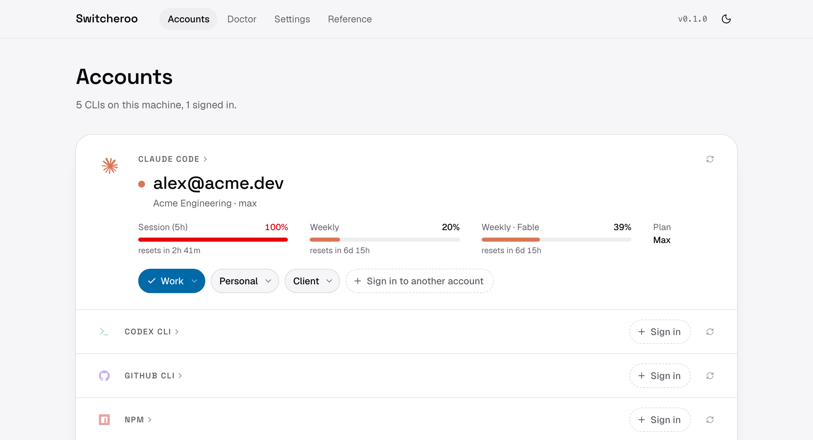

<div align="center">


</div>

<p align="center">
  <picture>
    <source media="(prefers-color-scheme: dark)" srcset=".github/accounts-dark.png">
    
  </picture>
</p>

### Switch the signed-in account of your CLIs.

Work account, personal account, a client's account: most developer CLIs only hold one login at a time, so you end up signing out and back in all day. Switcheroo remembers each login in your OS credential store and puts the one you want back in a second, for Claude Code, Codex, Vercel, Wrangler, npm, Fly.io and more.

It does not create profiles or config directories. It swaps the CLI's **live login**, so every terminal, editor integration and script that uses that CLI follows along. For CLIs that report it (Claude Code, Codex, GitHub CLI) it also shows how much of each account's allowance is used and when it resets, so you know which account to switch to.

```sh
switcheroo save claude-code                 # remember the login you have now
switcheroo login claude-code                # sign in as someone else, remember that too
switcheroo use claude-code work@acme.dev    # switch; the previous login is remembered first
switcheroo tray                             # menu-bar quick switcher + web UI
```

## Install

macOS and Linux:

```sh
curl -fsSL https://raw.githubusercontent.com/ftchd/switcheroo/main/install.sh | sh
```

Windows (PowerShell):

```powershell
irm https://raw.githubusercontent.com/ftchd/switcheroo/main/install.ps1 | iex
```

To build from source you need Rust and Node:

```sh
cd web && npm ci && npm run build && cd ..
cargo build --release          # → target/release/switcheroo
```

## Three ways to use it

- **Terminal**. Every operation is a `switcheroo` subcommand with `--json` output, so it scripts well. `switcheroo --help` or the Reference page in the web UI lists them all.
- **Web UI**. `switcheroo open` starts a loopback-only server and opens a page showing each CLI, who it is signed in as, and the remembered accounts to switch to, plus diagnostics and settings.
- **Tray**. `switcheroo tray` adds a menu-bar item with one submenu per CLI. Click an account to switch, "Save current login" to remember a login you made with the CLI itself, "Add account…" to open a terminal running the CLI's own sign-in. `switcheroo autostart enable` (or the "Start at login" toggle) makes it open when you sign in to the machine.

## Supported CLIs

| CLI | Mechanism | What is touched |
|---|---|---|
| Claude Code | swap | keychain item `Claude Code-credentials` (macOS) or `~/.claude/.credentials.json`, plus `oauthAccount` in `~/.claude.json`; running sessions pick the change up |
| Codex CLI | swap | `~/.codex/auth.json` (file credential mode); restart running sessions |
| GitHub CLI | native | `gh auth switch --user`; gh keeps the accounts itself |
| Vercel | swap | global `auth.json` token and `currentTeam` |
| Cloudflare Wrangler | swap | OAuth login `default.toml` |
| npm (also pnpm, yarn v1, bun) | swap | only the `//registry.npmjs.org/:_authToken` line of `~/.npmrc` |
| Fly.io | swap | `~/.fly/config.yml`, taking flyctl's lock first |
| Netlify | native | `netlify switch --email`; Netlify keeps the accounts itself |
| Gemini CLI, Turso, Expo / EAS, Railway | swap | **experimental**: formats verified from source, not yet on real logins |

**Swap** means Switcheroo captures the CLI's credential into your credential store and writes a remembered one back in its place. **Native** means the CLI already keeps several accounts and Switcheroo only runs its switch command; nothing is stored.

`switcheroo providers` prints this list with the exact files for your OS. Only CLIs found on `PATH` are managed; a tool installed inside a single project (for example `wrangler` in a repo's `node_modules/.bin`) is not visible until it is installed globally or its directory is on `PATH`. Doctor explains this next to the list of directories searched.

## How a switch works

1. Take a lock so the CLI and the tray never interleave.
2. Read the live credential and re-remember it under the account that is currently signed in. Tokens rotate, so the remembered copy must always be the freshest one.
3. Write the target account's credential into the slot.
4. Ask the CLI who is signed in. On a mismatch, the previous login is restored.

Before switching, Switcheroo warns about anything that would make it a no-op: environment variables the CLI prefers over its stored login (`GH_TOKEN`, `CLOUDFLARE_API_TOKEN`, `VERCEL_TOKEN`, `ANTHROPIC_API_KEY`, …), a CLI that caches credentials at startup, or an unsupported storage mode such as Codex's keyring option.

## Security

- Secrets live only in the OS credential store: macOS Keychain, Windows Credential Manager, or Linux Secret Service. `--vault file` opts into a 0600 JSON file for machines without one. Switcheroo's own `state.json` holds emails, labels and timestamps, never tokens.
- On macOS the keychain is accessed through `/usr/bin/security`, the same tool Claude Code uses. Items created that way never trigger access prompts, and updating the binary does not break access.
- The web UI listens on loopback only. Every mutation needs a per-launch session token in a custom header, which cross-site requests cannot supply, and the API never returns credential bytes.
- Nothing leaves your machine. There is no telemetry and no network access beyond the CLIs' own `whoami` commands.

## Command reference

| Command | What it does |
|---|---|
| `switcheroo` / `status [--refresh]` | Every detected CLI, who it is signed in as, remembered accounts |
| `save <provider> [--label NAME]` | Remember the current login |
| `login <provider> [--label NAME]` | Run the CLI's sign-in here, then remember the result |
| `use <provider> [account]` | Switch; account by email, label or unique fragment, picker if omitted |
| `list [provider]` · `rename` · `remove` | Manage remembered accounts |
| `usage [provider] [--refresh]` | Used quota and reset times for signed-in accounts |
| `doctor` · `providers` | Diagnostics and the provider catalog |
| `tray` · `serve [--bind]` · `open` | Run the tray, the web server, or open the UI |
| `autostart enable\|disable\|status` | Start the tray at login |
| `completions <shell>` | Shell completions |

Global: `--json`, `--vault auto|keychain|file`, `--data-dir DIR`, `-v`, `-q`. Exit codes: `0` ok, `1` error, `2` usage, `3` CLI not installed, `4` nothing signed in.

## Development

```sh
cargo test                                          # Rust unit tests, incl. a real keychain round trip on macOS
cd web && npm install && npm run dev                # Vite on :5173, proxies /api to :7777
cargo run -- serve --dev --bind 127.0.0.1:7777      # dev server with a fixed session token
```

The architecture, invariants and the checklist for adding a provider are in [`CLAUDE.md`](CLAUDE.md). A provider is one file under `src/providers/` built from a few slot adapters and an identity resolver, plus one line in the registry; the CLI, API, tray and web UI pick it up without changes.

## License

[MIT](LICENSE)
